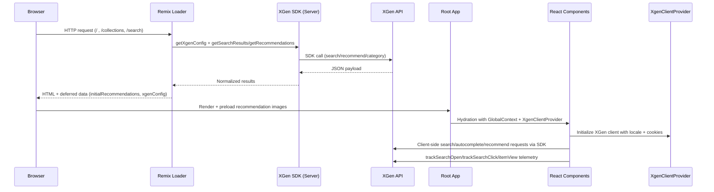
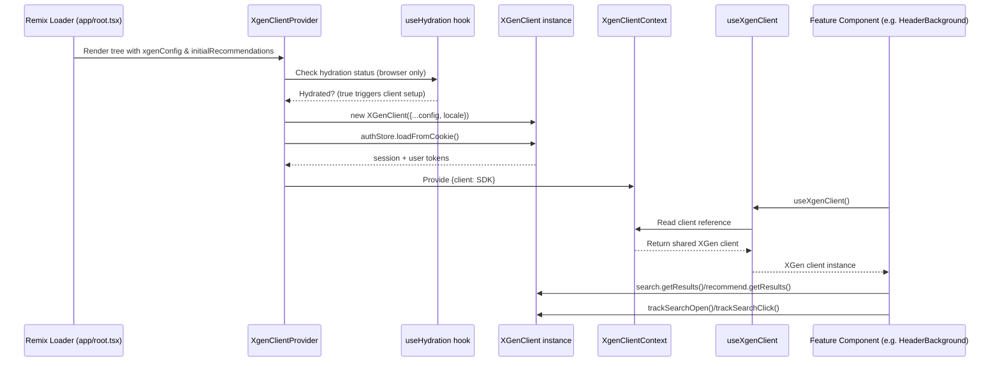

# XGen Platform Integration

## Background
J.McLaughlin previously relied on Constructor.io for search, autocomplete, and curated pod recommendations. This release migrates those surfaces to XGen so the storefront can take advantage of unified product data, richer telemetry, and faster response times while maintaining existing Hydrogen UI components. The migration spans server loaders, shared contexts, and client-side experiences.

## Objectives
- Replace Constructor.io services with XGen for search, autocomplete, and recommendations without regressing storefront UX.
- Centralize configuration and runtime access to XGen credentials for both server and client execution paths.
- Normalize incoming XGen payloads so that existing UI layers (cards, carousels, filters) can render with minimal disruption.

## Architecture Overview
- **Service layer**: Thin proxy helpers wrap the XGen SDK in `app/utils/xgen.ts`, exposing `getXgenClient`, `getSearchResults`, `getRecommendations`, `getCategoryPage`, and `getInitialRecommendations` for loader usage.
- **Application bootstrap**: The root loader in `app/root.tsx` assembles locale-aware config, preloads initial recommendations, and injects everything into Remix’s deferred data payload.
- **React context**: `app/contexts/XgenClientContext.tsx` instantiates the SDK on the client, hydrates auth cookies, and exposes `useXgenClient`/`useXgenClientWhenReady` hooks to any component that needs to call into XGen.
- **Global state propagation**: `app/lib/utils.ts` adds `xgenConfig` to the existing `GlobalContext`, ensuring that deployment IDs and locale data are accessible throughout the component tree.
- **UI surfaces**: Search routes, collection routes, and recommendation modules now pull XGen data with shared utilities for facets, pods, telemetry, and product price hydration.

## Request Lifecycle
The following sequence diagram captures how data flows from the browser through loaders and back into client-side interactions:

## Configuration & Environment
Environment bindings are declared in `remix.env.d.ts` and merged into runtime config via `getXgenConfig`.

| Variable | Purpose | Notes |
| --- | --- | --- |
| `XGEN_CLIENT_ID`, `XGEN_KEY`, `XGEN_SECRET` | SDK credentials | Required on both server and client.
| `XGEN_TRACKER_ID` | Enables telemetry calls (`track.*`) | Consumed by `XgenClientProvider` and analytics helpers.
| `XGEN_DEPLOYMENT_ID` | Default search deployment | Used by search loaders and autocomplete.
| `XGEN_PLP_DEPLOYMENT_ID` | Collection listing deployment | Applied when browsing collections.
| `XGEN_HP_BEST_SELLERS_ID`, `XGEN_TRENDING_ID` | Preconfigured pods | Power homepage and fallback recommendations.
| `WILDCARD_DOMAIN` | Cookie domain for auth store | Ensures XGen tracking cookies work across checkout.

`XgenIds` is exported from `app/root.tsx` so pod IDs can travel through the loader and into the client configuration.

## Server-Side Integration
- `getXgenConfig` in `app/utils/xgen.ts` maps `AppLoadContext.env` keys into the SDK schema, supplying a `getLocale` fallback that the loader overwrites with the resolved storefront locale.
- `getXgenClient` memoizes a single SDK instance per worker so repeated loader invocations reuse the same authenticated client. This prevents unnecessary token exchanges and keeps rate limiting predictable.
- `getSearchResults`, `getCategoryPage`, and `getRecommendations` forward the Remix `options` payload to the SDK, allowing loaders to specify deployment IDs, sorting, pagination, and facet filters that are derived from URL parameters or CMS configuration.
- `getInitialRecommendations` retrieves a Trending pod (if configured), annotates the first available variant URL for deep-linking, and returns the data to the root loader. The helper swallows recoverable errors to keep SSR output stable.
- When the root loader preloads recommendations it also precomputes `<link rel="preload">` tags for the associated imagery, minimizing layout shift during hydration.

## Application Bootstrap
Within `app/root.tsx` the loader performs several XGen-specific responsibilities:
- Resolves localization via Global-E helpers, applies the locale to `xgenConfig`, and serializes the enriched config through Remix `defer`.
- Calls `getInitialRecommendations` so hero carousels and cart pods can render without waiting for client-side requests, and injects the results into the `initialRecommendations` field returned from the loader.
- Defers additional Shopify/Sanity queries while still preloading recommendation images in the `<head>` to avoid hydration flicker.
- Wraps the hydrated tree with `XgenClientProvider`, ensuring every route and component shares the same browser-side client instance via context.

`GlobalContext` (defined in `app/lib/utils.ts`) now carries `xgenConfig`, storefront credentials, and event tracking metadata. Components that previously consumed Constructor configuration continue to work by reading from the same context shape.

## Client-Side Provisioning
- `XgenClientProvider` in `app/contexts/XgenClientContext.tsx` waits for hydration, instantiates a browser-side XGen client, repopulates the authStore from cookies, and re-exports fresh cookies with the configured domain, secure, and same-site attributes.
- Components call `useXgenClient` to receive the shared client. `useXgenClientWhenReady` provides a readiness guard for experiences that must defer rendering until the SDK is available.
- `useInitialRecommendations` in `app/hooks/useInitialRecommendations.tsx` gives React components immediate access to server-fetched trending items for optimistic UI.

### XGen Provider & Hook Flow
The diagram below highlights how configuration from the root loader travels through the provider, context, and hooks before being consumed by feature modules:

Feature modules such as `app/components/global/HeaderBackground.tsx`, `app/components/cart/BestSellers.tsx`, and `app/components/modules/PodSlider.tsx` call `useXgenClient` to fetch data or emit telemetry. Because the provider centralizes cookie management and locale injection, every caller works with an authenticated client that stays in sync with loader configuration and tracker state.

## Search Experience
1. **Loader**: `app/routes/($lang).search.tsx` validates locale, parses URL parameters, builds the XGen `options` payload (zero-based pagination, `pageSize`, deployment IDs, facet context), and calls `getSearchResults`. The raw SDK response is returned via Remix `json` so the client receives query IDs and facet summaries alongside item data.
2. **State management**: The `Search` component hydrates items, facets, groups, and total counts into local state, while also setting up pagination, per-page selectors, and view toggles. Subsequent interactions reuse the shared client from context rather than reloading the page.
3. **Facet helpers**: URL utilities in `app/utils/extractFiltersFromUrl.ts` and `app/utils/extractSortFromUrl.ts` translate query strings into the `context` object expected by XGen. Responses are fed through `normalizeAllFacets` from `app/utils/normalizeFacets.ts` to generate Constructor-style facet definitions for the filter UI, including synonym handling and range conversion for price facets.
4. **Autocomplete**: `app/components/global/HeaderBackground.tsx` debounces user input, calling `search.getResults` and the bespoke `fetchSuggestions` helper in `app/lib/xgen/utils/fetchSuggestions.ts`. The results flow into `app/components/filters/AutocompleteSearchResults.tsx`, which renders product hits, query suggestions, and tracks user interactions using the SDK’s telemetry hooks.

## Recommendation Pods & Surfaces
- `XGEN_PODS` and `SANITY_XGEN_PODS_MAP` in `app/lib/xgen/constants.ts` unify pod identifiers and display labels between XGen and Sanity content modules and include production-ready fallback IDs for critical placements like homepage hero and cart drawers.
- `getPodBySanityId`/`getPodByXgenId` in `app/lib/xgen/utils/getPodById.ts` translate between CMS-friendly IDs and the actual XGen element IDs used by SDK calls so content authors can continue referencing familiar handles.
- Cart, homepage, and search fallback experiences (`app/components/cart/BestSellers.tsx`, `app/components/global/RecommendationsResults.tsx`, `app/components/modules/PodSlider.tsx`) call `recommend.getResults` or `recommend.getResultsById` using the resolved pod IDs. Components fall back to `useInitialRecommendations` when no pod is configured or when XGen returns an empty payload.
- `app/lib/xgen/utils/podIdMapping.ts` introduces a localStorage-backed mapping and a custom `pod-storage-change` event so QA can override pod IDs during testing without redeploying code. `app/components/modules/PodSlider.tsx` exposes these helpers when `?xgen-debug=1` is present and registers listeners that re-fetch recommendations when the mapping changes.

## Product Presentation & Data Normalization
- Recommendation cards now consume the SDK’s `RecommendProduct` shape directly through `app/components/product/CioCard.tsx`, preserving swatch pickers, quick view, and wishlist interactions while reading XGen fields (`prod_code`, `prod_name`, `variants`, `image`).
- Legacy modules that still expect Constructor payloads use the transformer utilities in `app/lib/xgen/utils/transformProduct.ts` to convert XGen data into `CioBsResult` structures, including synthesized variation maps and variant-level pricing.
- `fetchShopifyPrices` and `returnPriceData` in `app/lib/utils.ts` accept numeric `prod_code` identifiers, hydrate localized pricing, and feed that information into recommendation cards and sliders. The helper gracefully handles empty responses to avoid rendering errors on low-stock SKUs.

## Telemetry & Tracking
- The analytics helpers in `app/utils/eventTracking.ts` now emit XGen-specific tracking events: `trackSearchOpen`, `trackSearchClick`, and `pushViewItemXgen` call into the SDK’s tracking APIs while preserving Elevar data layer hooks where required for downstream marketing integrations.
- `app/components/filters/AutocompleteSearchResults.tsx` and other search-facing components call these helpers so search opens, result clicks, and product views carry the correct `deploymentId`, `queryId`, and item identifiers, ensuring attribution remains accurate.
- The shared `GlobalContext` provides customer, locale, and cart metadata that is passed into telemetry payloads. This keeps analytics consistent with Shopify and Sanity integrations and allows for future personalization rules that depend on locale or customer segment.

## Debugging & Operational Notes
- Append `?xgen-debug=1` to any storefront URL to register `window.__xgen` helper methods, allowing engineers to inspect or mutate pod mappings on the fly.
- Pod overrides are stored under the `pod-id-mapping` key in localStorage; the helper module emits a `pod-storage-change` custom event so components can react without a full reload.
- `getInitialRecommendations` catches and logs recoverable errors (permitted via relaxed ESLint rules in `.eslintrc.js`), ensuring SSR remains stable even if the XGen API is temporarily unavailable.

## Migration Impact & Deprecations
- Constructor-specific contexts and helper imports were removed in favor of the new XGen provider, notably replacing the old CIO client context with `app/contexts/XgenClientContext.tsx`.
- `package.json` now includes `@xgenai/sdk-core` while retaining any Constructor UI packages that are still needed for non-data concerns.
- Search, collection, and recommendation flows now share a single data model (`SearchProduct` / `RecommendProduct`), reducing the amount of adaptor logic per surface and simplifying future enhancements such as personalization or A/B testing.

## Open Items & Future Enhancements
- `getRecommendations` still returns raw SDK results; add a shared normalizer if downstream consumers require the transformed Constructor shape.
- `app/lib/xgen/utils/fetchSuggestions.ts` calls an internal REST endpoint because the SDK does not yet expose suggestions; migrate once an official method ships to reduce maintenance burden.
- Deployment IDs could be consolidated into a single source of truth (e.g., CMS or environment) to keep telemetry consistent across surfaces like `/collections` and `/search`.
- Audit remaining Constructor dependencies and remove them when they are no longer referenced by UI modules.
